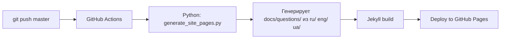

# 📐 Структура проекта и стандарты файлов — JavaInterview_v2

> **Назначение:** Этот документ — единственный источник истины о структуре проекта, формате файлов и правилах именования. Любая нейросеть, разработчик или контрибьютор должен сверяться с этим документом при создании или редактировании контента.

> ⚠️ **Важное правило работы с контентом:** При создании, проверке, анализе и редактировании контента **не используются какие-либо скрипты автогенерации или автоматического редактирования**. Все проверки, аудит и изменения выполняются нейросетью пошагово вручную без применения скриптов массового изменения.

---

## 🗂️ Корневая структура

```
JavaInterview_v2/
├── README.md                    # Главный README (ENG)
├── LICENSE                      # MIT License
├── PROJECT_STRUCTURE.md         # Структура проекта и стандарты
├── .gitignore
├── .github/
│   └── workflows/
│       └── pages.yml            # CI/CD: push master → generate pages → Jekyll → deploy
│
├── ru/                          # 🇷🇺 Русский контент (528 .md файлов)
│   ├── README.md                # Оглавление русской секции
│   └── {1..20}. {Название}/     # 20 тематических секций
│       ├── 00. Навигатор по разделу.md
│       └── {1..N}. {Вопрос}.md
│
├── eng/                         # 🇬🇧 Английский контент (528 .md файлов)
│   ├── README.md
│   └── {1..20}. {Section Name}/
│       ├── 00. Section Navigator.md
│       └── {1..N}. {Question}.md
│
├── ua/                          # 🇺🇦 Украинский контент (528 .md файлов)
│   ├── README.md
│   └── {1..20}. {Назва}/
│       ├── 00. Навігатор по розділу.md
│       └── {1..N}. {Питання}.md
│
├── docs/                        # GitHub Pages (Jekyll сайт)
│   ├── _config.yml              # Jekyll конфиг
│   ├── index.md                 # Landing page (ENG)
│   ├── ru/index.md              # Landing page (RU)
│   ├── uk/index.md              # Landing page (UA)
│   ├── 404.html
│   ├── robots.txt
│   ├── googleb845076b8b1fd464.html  # Google verification
│   ├── _layouts/
│   │   ├── default.html         # Базовый шаблон (header, nav, footer)
│   │   └── content-page.html    # Шаблон для answer pages
│   ├── assets/
│   │   ├── css/site.css         # Стили сайта
│   │   └── social-preview/github-social-preview.png
│   ├── topics/                  # SEO topic pages (20 штук)
│   │   ├── spring-boot-interview-questions.md
│   │   ├── sql-postgresql-interview-questions.md
│   │   └── ... (по одной на секцию)
│   ├── questions/               # ⚠️ .gitignore — генерируется скриптом
│   ├── ru/questions/            # ⚠️ .gitignore — генерируется скриптом
│   └── uk/questions/            # ⚠️ .gitignore — генерируется скриптом
│
└── scripts/
    └── generate_site_pages.py   # Генерирует answer pages из MD → docs/questions/
```

---

## 📁 20 тематических секций

| # | Папка (ru/) | Папка (eng/) | Папка (ua/) | Вопросов |
|---|-------------|-------------|-------------|----------|
| 1 | `1. Базы данных SQL PostgreSQL` | `1. Databases SQL PostgreSQL` | `1. Бази даних SQL PostgreSQL` | 21 |
| 2 | `2. Паттерны проектирования` | `2. Design Patterns` | `2. Патерни проєктування` | 16 |
| 3 | `3. Память и Garbage Collection` | `3. Memory and Garbage Collection` | `3. Пам'ять та Garbage Collection` | 28 |
| 4 | `4. Коллекции` | `4. Collections` | `4. Колекції` | 30 |
| 5 | `5. Spring Spring Boot` | `5. Spring Spring Boot` | `5. Spring Spring Boot` | 29 |
| 6 | `6. REST HTTP` | `6. REST HTTP` | `6. REST HTTP` | 17 |
| 7 | `7. Исключения` | `7. Exceptions` | `7. Винятки` | 29 |
| 8 | `8. Stream API` | `8. Stream API` | `8. Stream API` | 29 |
| 9 | `9. Многопоточность` | `9. Concurrency` | `9. Багатопоточність` | 27 |
| 10 | `10. HashMap equals hashCode` | `10. HashMap equals hashCode` | `10. HashMap equals hashCode` | 29 |
| 11 | `11. Транзакции` | `11. Transactions` | `11. Транзакції` | 22 |
| 12 | `12. String` | `12. String` | `12. String` | 23 |
| 13 | `13. Иммутабельность` | `13. Immutability` | `13. Імутабельність` | 29 |
| 14 | `14. Docker Kubernetes` | `14. Docker Kubernetes` | `14. Docker Kubernetes` | 24 |
| 15 | `15. Kafka` | `15. Kafka` | `15. Kafka` | 30 |
| 16 | `16. Hibernate JPA` | `16. Hibernate JPA` | `16. Hibernate JPA` | 30 |
| 17 | `17. Микросервисы` | `17. Microservices` | `17. Мікросервіси` | 26 |
| 18 | `18. ООП и SOLID` | `18. OOP and SOLID` | `18. ООП та SOLID` | 22 |
| 19 | `19. CompletableFuture и асинхронность` | `19. CompletableFuture and Asynchrony` | `19. CompletableFuture та асинхронність` | 28 |
| 20 | `20. Records и Дженерики` | `20. Records and Generics` | `20. Records та Дженерики` | 27 |

**Правило:** Каждая секция содержит `N+1` файлов: 1 навигатор (`00.`) + N файлов с вопросами.

---

## 📄 Формат файла-ответа (Эталон)

### Имя файла
```
{номер}. {Вопрос на языке секции}.md
```
Примеры:
- `1. Для чего нужны индексы.md` (ru)
- `1. What are indexes and why are they needed.md` (eng)
- `1. Для чого потрібні індекси.md` (ua)

### Структура контента

```markdown
# {Вопрос}

## 🟢 Junior Level

{Простое определение, аналогия из жизни, базовый пример кода}

### {Подзаголовок (опционально)}
...

---

## 🟡 Middle Level

{Внутреннее устройство, нюансы, частые ошибки, trade-offs}

### {Подзаголовок}
```java
// Примеры кода с комментариями
```

---

## 🔴 Senior Level

{Глубокие детали: JVM internals, production scenarios, бенчмарки, edge cases}

### {Подзаголовок}
```java
// Продвинутые примеры
```

---

## 🎯 Шпаргалка для интервью

**Обязательно знать:**
- ...

**Частые уточняющие вопросы:**
- ...

**Красные флаги (НЕ говорить):**
- ...

**Связанные темы:**
- [Название](относительная_ссылка.md)
```

### Обязательные элементы

| Элемент | Обязательность | Описание |
|---------|---------------|----------|
| `# {Вопрос}` (H1) | ✅ Обязательно | Один H1, совпадает с именем файла |
| `## 🟢 Junior Level` | ✅ Обязательно | Секция Junior |
| `## 🟡 Middle Level` | ✅ Обязательно | Секция Middle |
| `## 🔴 Senior Level` | ✅ Обязательно | Секция Senior |
| Блоки кода (```) | ✅ Обязательно | Минимум 1 пример кода |
| `---` (разделители) | ✅ Обязательно | Между секциями уровней |
| `## 🎯 Шпаргалка` | ⚡ Рекомендуется | Краткая выжимка для повторения |
| Связанные темы | ⚡ Рекомендуется | Ссылки на связанные вопросы |

### Минимальные требования к размеру

| Метрика | Минимум | Среднее | Максимум |
|---------|---------|---------|----------|
| Размер файла | 3.3 KB | 10.7 KB | 37.2 KB |
| Строки | ~50 | ~200 | ~500 |
| Блоки кода | 1 | 3-5 | 15+ |

---

## 📄 Формат файла-навигатора (00.)

### Имя файла
- `00. Навигатор по разделу.md` (ru)
- `00. Section Navigator.md` (eng)
- `00. Навігатор по розділу.md` (ua)

### Структура контента

```markdown
# {Название раздела}

## 📋 Содержание

| # | Вопрос | Уровень |
|---|--------|---------|
| 1 | [Вопрос 1](1.%20Вопрос%201.md) | 🟢🟡🔴 |
| 2 | [Вопрос 2](2.%20Вопрос%202.md) | 🟢🟡🔴 |
| ... | ... | ... |

---

## 🗺️ Карта обучения

### 🟢 Junior
- Вопросы {список номеров}

### 🟡 Middle
- Вопросы {список номеров}

### 🔴 Senior
- Вопросы {список номеров}
```

---

## 📄 Формат SEO Topic Page (docs/topics/)

### Имя файла
```
{topic-slug}-interview-questions.md
```
Примеры: `spring-boot-interview-questions.md`, `kafka-interview-questions.md`

### Структура контента

```markdown
---
layout: default
title: {Topic} Interview Questions and Answers
description: {SEO description, 150-160 chars}
lang: en
image: /assets/social-preview/github-social-preview.png
---

<section class="hero">
  <span class="eyebrow">Topic Page</span>
  <h1>{Topic} interview questions and answers.</h1>
  <p class="lede">{2-3 предложения описания}</p>
  <div class="hero-actions">
    <a class="button button-primary" href="...">Browse {Topic} answers</a>
    <a class="button" href="{{ '/' | relative_url }}">Back to home</a>
  </div>
</section>

<section class="section">
  <h2>What this {Topic} section includes</h2>
  <p>{2 абзаца о содержании}</p>
</section>

<section class="section">
  <h2>Representative {Topic} interview questions</h2>
  <ol class="topic-list">
    <li>{Вопрос 1}</li>
    ...
    <li>{Вопрос 10}</li>
  </ol>
</section>

<section class="section">
  <h2>Related pages</h2>
  <div class="card-grid">
    <article class="card">
      <h3 class="card-title"><a href="...">{Related topic}</a></h3>
      <p>{Почему связано}</p>
    </article>
    ...
  </div>
</section>
```

---

## 📄 Формат README секции (ru/, eng/, ua/)

### Обязательные секции

```markdown
# {Название проекта}

{Описание: 500+ вопросов, 3 уровня, 20 тем}

## Структура ответов
- 🟢 Junior Level — ...
- 🟡 Middle Level — ...
- 🔴 Senior Level — ...

## Оглавление (Table of Contents)
### 1. {Секция 1} ({N} вопросов)
1. {Вопрос 1}
2. {Вопрос 2}
...

### 2. {Секция 2} ({N} вопросов)
...
```

---

## ⚙️ CI/CD Pipeline



**Важно:** Директории `docs/questions/`, `docs/ru/questions/`, `docs/uk/questions/` — **генерируемые** и включены в `.gitignore`. Не редактировать вручную!

---

## 🔗 Правила ссылок

### Внутри MD-файлов (между вопросами одной секции)
```markdown
[Название вопроса](2.%20Название%20вопроса.md)
```
- Используем **относительные пути** с URL-кодированием пробелов (`%20`)

### В README (ссылки на секции)
```markdown
[Секция 1](1.%20Базы%20данных%20SQL%20PostgreSQL/)
```

### В docs/ (Jekyll)
```markdown
{{ '/questions/01-databases-sql-postgresql/' | relative_url }}
```

---

## 🌍 Кросс-языковой паритет

**Правило:** Каждый файл в одном языке ДОЛЖЕН иметь эквивалент в двух других.

| Проверка | Ожидание |
|----------|----------|
| Файлов в ru/ | 537 |
| Файлов в eng/ | 537 |
| Файлов в ua/ | 537 |
| Секций в каждом | 20 |
| Файлов в каждой секции | Одинаково для всех 3 языков |

### Проверка паритета (команда)
```powershell
$langs = @("ru","eng","ua")
foreach ($l in $langs) {
    $count = (Get-ChildItem "d:\Projects\JavaInterview_v2\$l" -Recurse -File -Filter "*.md").Count
    Write-Host "$l : $count files"
}
```

---

## 🧪 Валидация (скрипт аудита)

Скрипт `scripts/audit_all_files.ps1` проверяет:
1. Наличие H1 заголовка
2. Наличие маркеров `Junior`, `Middle`, `Senior`
3. Размер файла (минимум 3 KB)
4. Наличие блоков кода
5. Кросс-языковой паритет

```powershell
powershell -ExecutionPolicy Bypass -File scripts/audit_all_files.ps1
```
